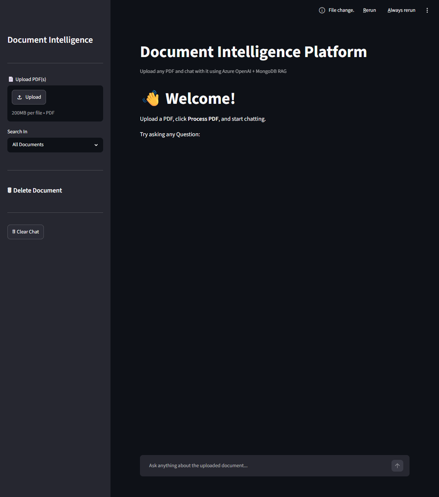
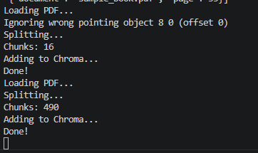
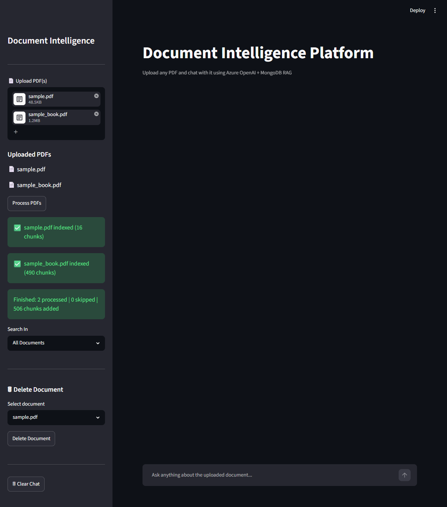
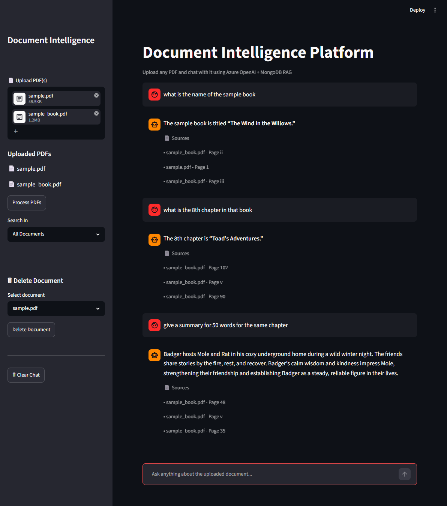
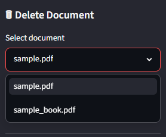
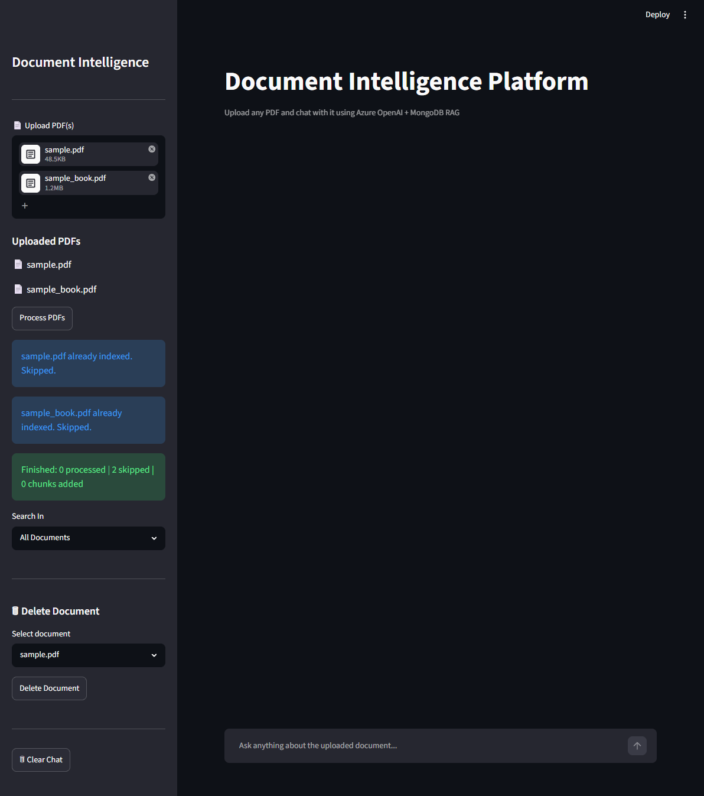
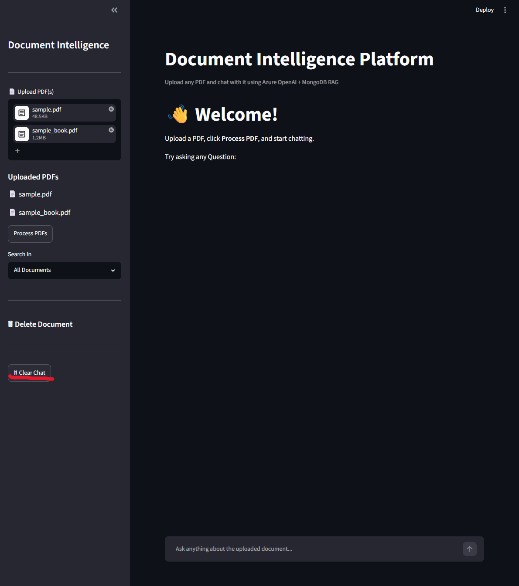

# 📄 Document Intelligence Platform

An AI-powered Document Intelligence Platform built using **Python, Streamlit, Azure OpenAI, ChromaDB, and MongoDB**.

Upload PDFs, automatically generate embeddings, search across documents, and chat with them using Retrieval-Augmented Generation (RAG).

---

# 🚀 Features

- 📂 Upload PDF documents
- 🧠 Automatic embedding generation
- 💬 Chat with uploaded documents
- 🔍 Search across all documents or a selected document
- 🗑 Delete unwanted documents
- 🚫 Duplicate document detection
- 🧹 Clear chat history
- ⚡ Azure OpenAI integration
- 📦 Chroma Vector Database
- 📁 Document Registry Management

---

# 🛠 Tech Stack

- Python
- Streamlit
- Azure OpenAI
- ChromaDB
- MongoDB
- LangChain
- PyPDF
- Sentence Transformers

---

# 📷 Application Screenshots

## Home



---

## Upload Documents


---

## Embedding Process



---

## Ready for Questions



---

## Chat Interface



---

## Search Within Selected Documents


---

## Delete Documents



---

## Duplicate Detection



---

## Clear Chat



---

# 📂 Project Structure

```
Document-Intelligence-Platform
│
├── app.py
├── requirements.txt
├── Images/
├── src/
│   ├── embedding.py
│   ├── ingest.py
│   ├── retriever.py
│   ├── rag_chain.py
│   ├── vector_store.py
│   ├── mongo_store.py
│   ├── llm.py
│   └── ...
│
├── uploads/
├── vector_db/
└── README.md
```

---

# ⚙️ Installation

```bash
git clone https://github.com/YOUR_USERNAME/Document-Intelligence-Platform.git

cd Document-Intelligence-Platform

pip install -r requirements.txt

streamlit run app.py
```

---

# Environment Variables

Create a `.env` file and configure the following:

```
AZURE_OPENAI_API_KEY=

AZURE_OPENAI_ENDPOINT=

AZURE_OPENAI_DEPLOYMENT=

MONGODB_URI=
```

---

# Future Improvements

- Multi-user authentication
- Support for DOCX, PPTX and Excel
- OCR for scanned PDFs
- Conversation export
- Source highlighting
- Cloud deployment

---

# Author

**Dhyaanesh G**

NIT Trichy

AI • LLMs • RAG • Document Intelligence
